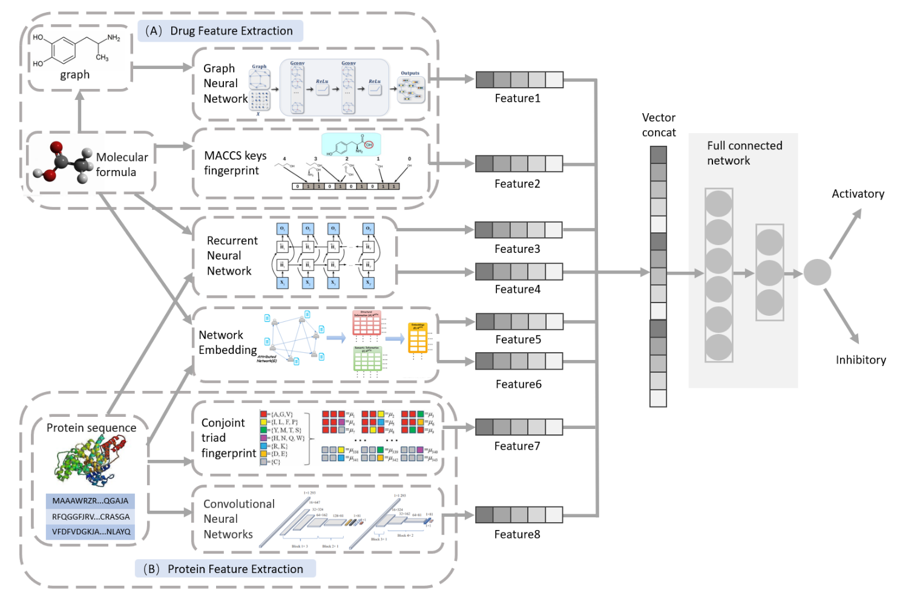

# Multi-View-DTP
## Title
A Multi-View Model for Predicting Drug–Target Activation/Inhibition Mechanisms
## Abstract
Accurate prediction of drug-target interaction mechanisms has significant implications for drug development and precision medicine, with activation/inhibition mechanisms being the primary types of drug action. In recent years, deep learning has shown tremendous potential in bioinformatics, but existing models still have limitations in capturing complex features of biomolecular sequences. This thesis proposes a multi-perspective drug-target activation/inhibition mechanism prediction model called DTP (Drug Target Predict), which integrates Graph Neural Networks (GNN) for processing molecular structures, Convolutional Neural Networks (CNN) for processing target protein sequences, Network Embedding (NE) for capturing interaction network features, and an RNN module. The study designs a flexible feature fusion strategy that integrates multi-perspective information through fully connected layers and systematically analyzes the impact of the RNN module on model performance through detailed ablation experiments. Experimental results show that the proposed DTP model outperforms existing methods in terms of accuracy, precision, AUROC, and AUPRC evaluation metrics, demonstrating significant advantages particularly in handling class imbalance and recognizing complex interaction patterns.

This thesis provides a new multi-perspective deep learning paradigm for predicting drug-target interaction mechanisms and offers new insights for sequence feature learning in bioinformatics. The thesis outcomes have important theoretical significance and application value for accelerating drug development and supporting precision medicine.

## Setup
```python
Python == 3.9.21
CUDA == 11.7
torch == 1.13.1+cu117
dgl-cu116 == 0.9.1
dgllife == 0.3.0
torch-geometric == 2.6.1
rdkit == 2024.9.5
biopython == 1.85
```
## Dataset
The experiment base on DrugBank Database
## Run model
